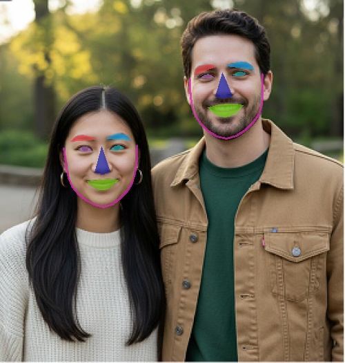

# Face-Landmark-Detector
Based on Dlib and OpenCV, 68 key points of the human face were extracted and colored

Face Landmark Detector (68 Points)
中文说明 | English Description

中文说明
📝 项目简介
本项目是一个基于 Dlib 和 OpenCV 的人脸关键点检测工具。它能够识别图像中的多张人脸，提取 68 个面部关键点坐标，并对五官区域（眼睛、眉毛、鼻子、嘴巴、下颌线）进行半透明彩色标注。

✨ 主要功能
多脸检测：支持在同一张照片中识别并标记多个人脸。

五官着色：自动计算凸包（Convex Hull）并对特定面部区域进行涂色可视化。

M3 Mac 优化：针对 Apple Silicon 芯片优化了内存连续性处理，彻底解决 Unsupported image type 报错问题。

🛠️ 安装步骤
克隆仓库

Bash
git clone https://github.com/AlyssaPei/Face-Landmark-Detector
cd Face-Landmark-Detector
安装依赖 (建议使用 Python 3.10)

Bash
pip install -r requirements.txt
📥 模型下载
由于 shape_predictor_68_face_landmarks.dat 模型文件较大 (约 100MB)，本项目未直接包含该文件。

请从 dlib 官方权重库 下载。Please download it from the [Official dlib model repository](http://dlib.net/files/shape_predictor_68_face_landmarks.dat.bz2).

解压并将 .dat 文件放入 models/ 文件夹下。

🚀 运行命令
Bash
python detect_face_parts.py -p models/shape_predictor_68_face_landmarks.dat -i data/lily.jpg

English Description
📝 Introduction
This project is a facial landmark detection tool built with Dlib and OpenCV. It identifies multiple faces in an image, extracts 68 facial coordinate points, and applies semi-transparent color masks to specific facial features (eyes, eyebrows, nose, mouth, and jawline).

✨ Key Features
Multi-face Detection: Capable of detecting and labeling multiple faces within a single image.

Feature Visualization: Automatically calculates convex hulls to draw and fill specific facial regions with color.

M3 Mac Optimized: Includes memory continuity fixes specifically for Apple Silicon (M1/M2/M3) to prevent Unsupported image type runtime errors.

🛠️ Installation
Clone the Repository

Bash
git clone https://github.com/AlyssaPei/Face-Landmark-Detector
cd Face-Landmark-Detector
Install Dependencies (Python 3.10 recommended)

Bash
pip install -r requirements.txt
📥 Model Download
The shape_predictor_68_face_landmarks.dat file is roughly 100MB and is not included in this repository.

Please download it from the Official dlib model repository.
Please download it from the [Official dlib model repository](http://dlib.net/files/shape_predictor_68_face_landmarks.dat.bz2).

Extract and place the .dat file inside the models/ directory.

🚀 Usage
Bash
python detect_face_parts.py -p models/shape_predictor_68_face_landmarks.dat -i data/lily.jpg
 85634ce (Initial commit: Multi-face landmark detection for M3 Mac)
